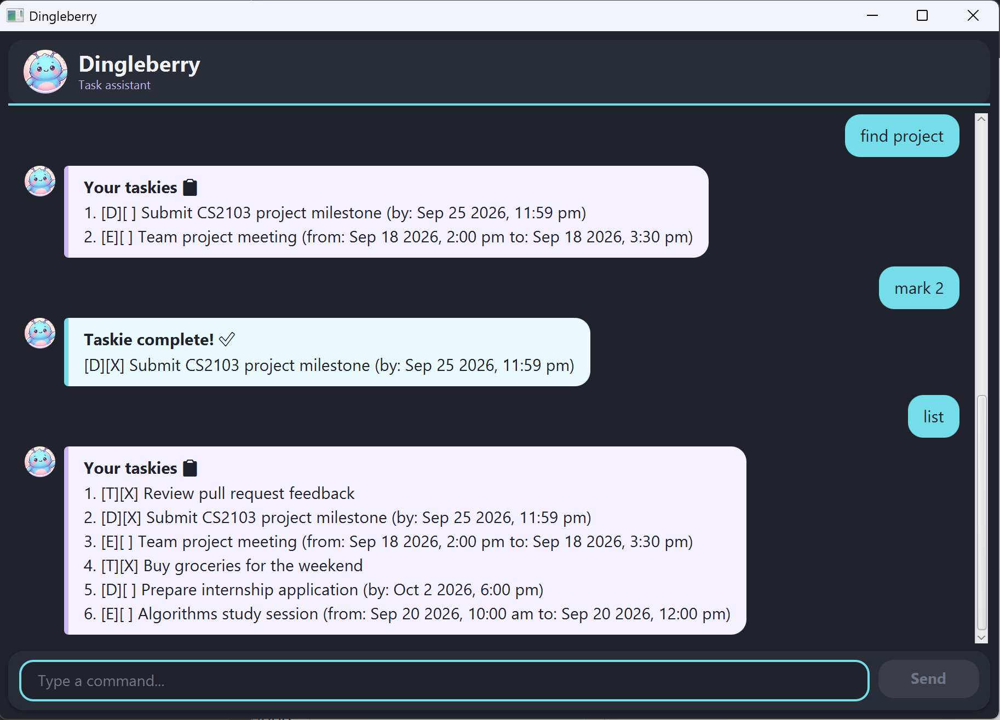

# Dingleberry User Guide



Dingleberry is a friendly task assistant for keeping todos, deadlines, and
events in one place. Enter commands in the chat window, and Dingleberry keeps
your task list saved between launches.

## Quick start

### Run from the project

Prerequisites: JDK 25 and a terminal opened at the project root.

On Windows, launch the GUI with:

```powershell
.\gradlew.bat run
```

On macOS or Linux, use:

```bash
./gradlew run
```

Type a command into the input field and press **Enter** or select **Send**.
For example, start with `todo read lecture notes`, then use `list` to see it.
Use `bye` to close the application.

### Run the packaged application

Build the executable JAR, then launch it:

```powershell
.\gradlew.bat shadowJar
java -jar build\libs\dingleberry.jar
```

On macOS or Linux:

```bash
./gradlew shadowJar
java -jar build/libs/dingleberry.jar
```

The application uses `./data/dingleberry.txt` for saved tasks. The data folder
and file are created automatically when they do not exist.

## Commands

Commands are case-insensitive, and extra whitespace is normalized. Use the
number shown by `list` when a command asks for a task number.

| Command | Purpose |
| --- | --- |
| `todo` | Add an ordinary task. |
| `deadline` | Add a task due at a specific date and time. |
| `event` | Add a task spanning a start and end date/time. |
| `list` | Show the full numbered task list. |
| `find` | Show tasks matching a keyword. |
| `mark` | Mark a task as complete. |
| `unmark` | Mark a task as incomplete. |
| `delete` | Remove a task. |
| `bye` | Close Dingleberry. |

### Add a todo

`todo` adds an ordinary task with no date or time.

**Syntax**

```text
todo <description>
```

**Example**

```text
todo return library books
```

Dingleberry adds the todo as an incomplete task and reports the new total.

### Add a deadline

`deadline` adds a task that is due at one date and time.

**Syntax**

```text
deadline <description> /by <date/time>
```

**Example**

```text
deadline submit report /by 2026-09-25 1800
```

The deadline is added and displayed with its due date and time.

### Add an event

`event` adds a task with a start and end date/time.

**Syntax**

```text
event <description> /from <date/time> /to <date/time>
```

**Example**

```text
event team meeting /from 2026-09-21 1400 /to 2026-09-21 1500
```

Dingleberry adds the event when the end is after the start, and displays both
times. The `/from` marker must come before `/to`.

### List all tasks

`list` shows every task in the full task list, in insertion order.

**Syntax**

```text
list
```

**Example**

```text
list
```

The result is a numbered list. A completed task is shown with `[X]`; an
incomplete task is shown with `[ ]`.

### Find tasks

`find` shows tasks whose descriptions contain a keyword, ignoring letter case.

**Syntax**

```text
find <keyword>
```

**Example**

```text
find report
```

Only matching tasks are displayed. The search does not change the full task
list.

### Mark a task complete

`mark` marks one task as done.

**Syntax**

```text
mark <task number>
```

**Example**

```text
mark 2
```

Task 2 is saved as complete and appears with `[X]`.

### Mark a task incomplete

`unmark` changes one completed task back to incomplete.

**Syntax**

```text
unmark <task number>
```

**Example**

```text
unmark 2
```

Task 2 is saved as incomplete and appears with `[ ]`.

### Delete a task

`delete` removes one task from the full task list.

**Syntax**

```text
delete <task number>
```

**Example**

```text
delete 3
```

Task 3 is removed and the remaining list is saved.

### Exit

`bye` closes Dingleberry.

**Syntax**

```text
bye
```

**Example**

```text
bye
```

Dingleberry stops accepting commands and closes the GUI.

## Date and time formats

Deadlines and event endpoints accept the following formats:

| Format | Example | Meaning |
| --- | --- | --- |
| 24-hour date and time | `2026-09-25 1800` | 25 September 2026 at 18:00 |
| Weekday | `Mon` or `Monday` | The next occurrence of that weekday at midnight |
| Relative weekday | `this Mon` or `next Monday` | The matching weekday relative to today |
| Weekday with time | `next Tue 2pm` | That weekday at 2:00 pm |
| Weekday with time | `Monday 2:30pm` or `Monday 2.30pm` | That weekday at 2:30 pm |
| Event end time only | `4pm` or `4:00pm` | Uses the date from the event's `/from` value |

Times use a 12-hour clock from 1am to 12pm. The minutes are optional when they
are `00`; otherwise use two digits. A time-only value is supported for an
event's `/to` value, but not as a standalone deadline date.

For a weekday without a qualifier, Dingleberry chooses the next occurrence;
the same weekday later in the week is preferred, and today's weekday resolves
to the following week. `this` allows today's weekday to resolve to today, while
`next` always selects the following occurrence. Dates must be real calendar
dates, and an event's end must be after its start. Expressions such as
`tomorrow` are not supported.

## Task numbers and search results

Task numbers are one-based and come from the numbered **full task list** shown
by `list`. They are not permanent IDs; deleting a task shifts later numbers.

`find` displays a numbered filtered copy, but those displayed numbers do not
become new task numbers. After `find`, use `list` before `mark`, `unmark`, or
`delete` if you are unsure which number refers to the full list.

## Saving and recovery

Dingleberry automatically saves after adding, deleting, marking, or unmarking a
task. `list` and `find` only read the current in-memory list. Data is stored in
`data/dingleberry.txt` relative to the project directory.

If the data file is missing, Dingleberry creates it and starts with an empty
list. If individual records are corrupted, valid records are loaded and each
skipped record is reported as a warning. If the file or its directory cannot
be read, Dingleberry reports the loading problem and starts with an empty list.
If a later save fails, it reports the storage error in the chat window.

## Troubleshooting

| Problem | What to check |
| --- | --- |
| Unknown command | Use one of `todo`, `deadline`, `event`, `list`, `find`, `mark`, `unmark`, `delete`, or `bye`. |
| Missing description, keyword, or task number | Supply the required value after the command, such as `find book` or `delete 1`. |
| Invalid date/time | Use `yyyy-MM-dd HHmm`, a supported weekday expression, or a valid 12-hour time such as `2:30pm`. Check that the calendar date exists. |
| Event rejected | Include both `/from` and `/to`, in that order, and make the end later than the start. |
| Duplicate task rejected | Check that the task type, description, and relevant dates or times differ from the existing task. |
| Task number out of range | Run `list` and use a positive number currently shown in the full list. |
| Changes are not saved | Check that `data/dingleberry.txt` and its parent folder are writable, then read the reported storage error. |
